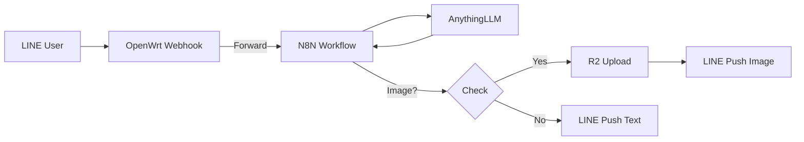

# N8N Workflow Setup Guide

使用 N8N 工作流整合 LINE Webhook、AnythingLLM 和 Cloudflare R2。

## 架構圖



## 前置需求

| 服務 | 說明 |
|------|------|
| **N8N** | 工作流自動化平台 |
| **AnythingLLM** | 統一 LLM 介面 |
| **Cloudflare R2** | 圖片託管（需開啟公開存取） |

## 環境變數設定

在 N8N 中設定以下環境變數：

```
ANYTHINGLLM_URL=http://your-anythingllm:3001/api/v1/workspace/your-workspace/chat
R2_ENDPOINT=https://<account-id>.r2.cloudflarestorage.com
R2_BUCKET=your-bucket-name
R2_PUBLIC_URL=https://pub-xxx.r2.dev
```

## 憑證設定

### 1. AnythingLLM API Key
- 類型: HTTP Header Auth
- Header Name: `Authorization`
- Header Value: `Bearer YOUR_ANYTHINGLLM_API_KEY`

### 2. Cloudflare R2 Auth
- 類型: HTTP Header Auth
- Header Name: `Authorization`
- 使用 S3 兼容的 AWS Signature V4

## 匯入工作流

1. 在 N8N Dashboard 中選擇 **Import**
2. 選擇檔案: `n8n-line-llm-workflow.json`
3. 設定環境變數
4. 建立並連接憑證
5. 啟用工作流

## OpenWrt 設定

```sh
uci set line_webhook.main.processor='n8n'
uci set line_webhook.main.n8n_webhook_url='http://your-n8n:5678/webhook/line'
uci set line_webhook.main.n8n_webhook_secret='your-secret'  # optional
uci commit line_webhook
/etc/init.d/line_webhook restart
```

## 功能說明

### 對話記憶
- 每個 LINE 用戶有獨立的對話記錄
- 保留最近 20 則訊息
- 儲存在 N8N Workflow Static Data

### 圖片處理
- 偵測 AnythingLLM 回應中的 base64 圖片
- 自動上傳至 Cloudflare R2
- 使用 R2 公開 URL 發送給 LINE

### 支援的圖片格式
工作流會識別以下格式：
- `[IMAGE:data:image/png;base64,...]`
- ``

## 疑難排解

| 問題 | 解決方案 |
|------|----------|
| N8N 沒收到訊息 | 確認 `n8n_webhook_url` 正確且可存取 |
| AnythingLLM 無回應 | 檢查 API Key 和 Workspace URL |
| R2 上傳失敗 | 確認 Bucket 權限和 API Token |
| LINE 回覆失敗 | 確認 access_token 正確傳遞 |

## MCP 整合 (進階)

若 AnythingLLM 支援 MCP，可在工作流中增加：
- 外部工具調用
- 資料庫查詢
- API 整合

修改 `AnythingLLM Chat` 節點的 payload 即可啟用 MCP 功能。
